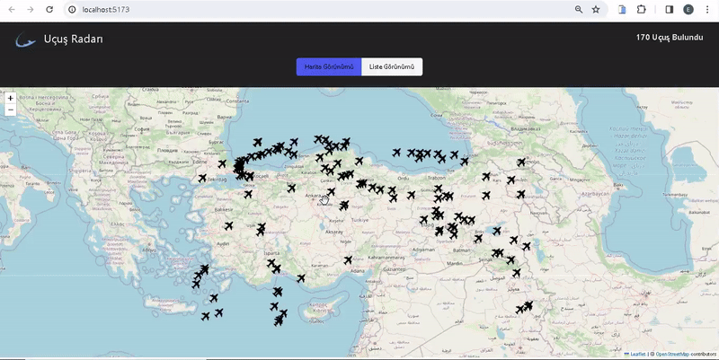

<h1> Flight_Radar_App </h1>

I've independently designed and coded a responsive Flight_Radar_App, and it's ready to explore!

🔸 Project Name: [Flight Radar App]

🔸 Technologies Used: - React, React-Leaflet, Redux Toolkit Thunk, React Paginate, Axios

🔸 Project Description: This app, which I designed and coded from scratch, works flawlessly on various devices, from mobile phones to desktop computers. In this application, users can track aircraft on the map, as well as flights between listed flights. You can view the details of the relevant flight by clicking on either page.

# Kütüphaneler

- @reduxjs/toolkit
- react-redux
- axios
- bootstrap
- leaflet
- react-leaflet

# API

- https://rapidapi.com/apidojo/api/flight-radar1

<h2>Screen_Shoot</h2>

